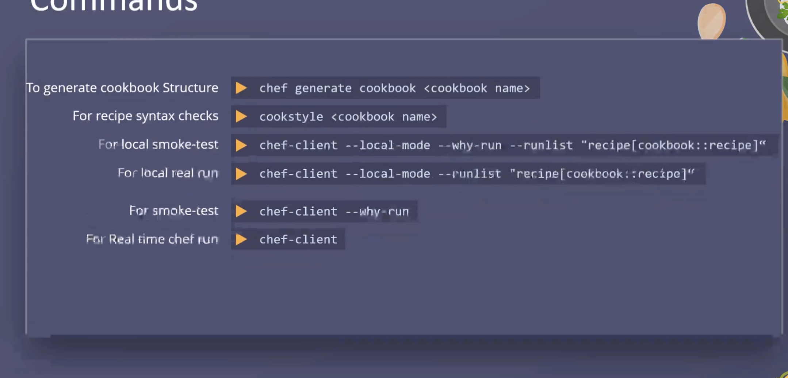

### chef zero 
### At chef workstation

syntax check
`cookstyle <reciepe file>`

smoke test. 
`chef-client --local-mode --why-run <reciepe file>`.  

Run
`chef-client --local-mode <reciepe file>`.  

For cookbooks

To generate cookbook
`chef genereate cookbook <name>`

syntax check
`cookstyle <cookbook>`

smoke test. 
`chef-client --local-mode --why-run <reciepe file>`.  

Run
`chef-client --local-mode <reciepe file>`.  

Runlist
To run multiple receipes
`chef-client --local-mode --runlist "receipe[cookbook-name::reciepe-name]"`.
If we have only one receipe, no need to give receipe name.   

### Server-client Setup

* Create Code
* Upload code
  To upload the code from workstation to the server, we use knife utility.
  Knife utility is used to interact with chef server, manage nodes, cookbooks, reciepes.  
  To communicate with the chef server, the information about the chef server must be defined under   
  `/chef-repo/.chef/knife.rb`.  
  To upload cookbook to the server.  
  `knife cookbook upload`.  
* Create Runlist
  Assign nodes to cookbooks and recipes.  
  `knife node run_list add Node_Name RUN_LIST_ITEM`. 
  `knife node run_list add node1 'recipe[WEB]'`.  
* Apply Code
  Login to the each node and run `chef-client` to pull down the required code and configure the nodes.   
  or use `knife ssh 'name:*' 'chef-client'` this is to kick off chef-client on all nodes.  

To check chef-server connectivity from workstation.  
`knife ssl check`.  

To upload cookbook on chef-server.  
`knife upload cookbook <cookbookname>`. 

To check all the uploaded cookbooks.  
`knife cookbook list`. 

### Unit test

unit file name should be spec/unit/recipes/<recipename_spec>.rb

To run unit test file
`chef exec rspec`.  

### Integration test

Integration file name should be test/integration/<recipe>/<recipename_test>.rb  

To run integration test. 
`kitchen create` - This creates box or docker image as mentioned in integration file.  
`kitchen converge` - This runs the cookbook on box.
`kitchen verify` - This run the integration tests on the box.
`kitchen destroy` - This destroys the box.

`Kitchen test` - This creates box, converges, verify the tests and destroy the box.  

